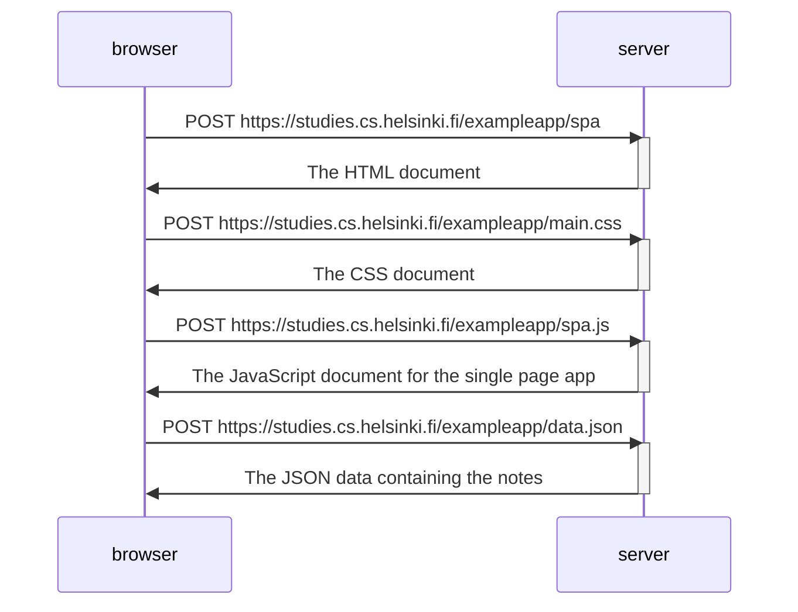

```mermaid
    sequenceDiagram
    participant browser
    participant server

    browser->>server: POST https://studies.cs.helsinki.fi/exampleapp/spa
    activate server
    server->>browser: The HTML document
    deactivate server

    browser->>server: POST https://studies.cs.helsinki.fi/exampleapp/main.css
    activate server
    server->>browser: The CSS document
    deactivate server

    browser->>server: POST https://studies.cs.helsinki.fi/exampleapp/spa.js
    activate server
    server->>browser: The JavaScript document for the single page app
    deactivate server

    browser->>server: POST https://studies.cs.helsinki.fi/exampleapp/data.json
    activate server
    server->>browser: The JSON data containing the notes
    deactivate server
```
